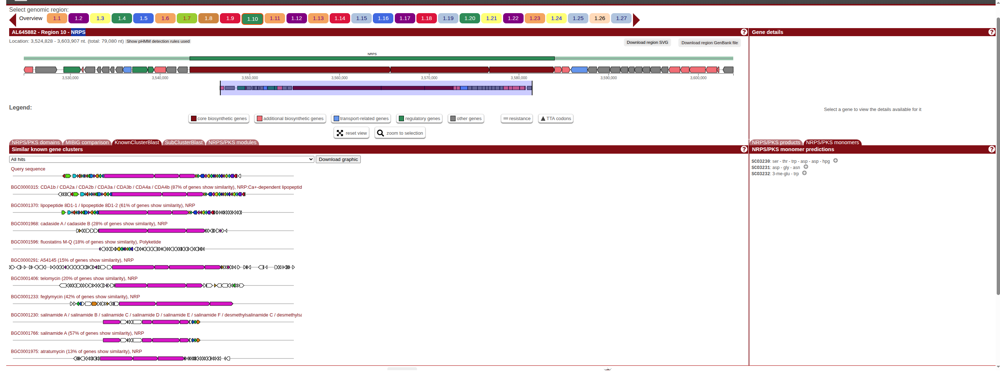
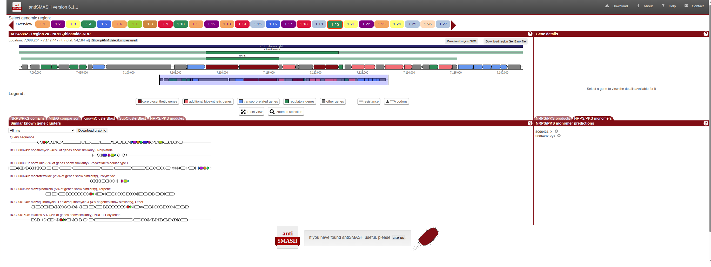
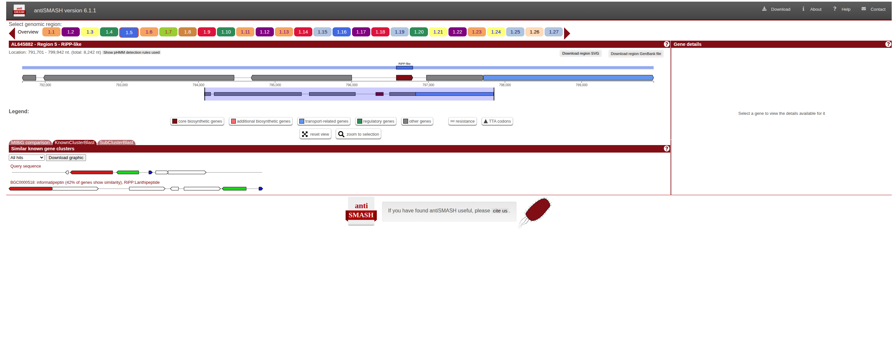
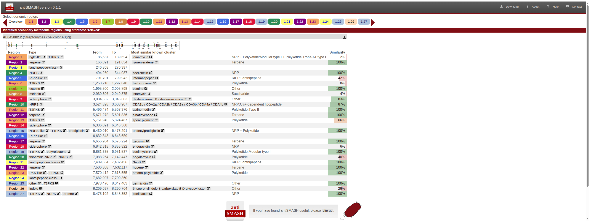

# 🧬 *Streptomyces coelicolor* Genome Mining for Antifungal Discovery

<div align="center">


**Learning computational approaches to natural product discovery**

</div>

---

## 👋 About This Project

I'm an undergraduate researcher studying natural products. My thesis work isolated endophytes from medicinal plants that showed activity against *Candida albicans*, but I wanted to understand: **What genes make these antifungal compounds?**

This project is my journey learning genome mining—using computational tools to predict biosynthetic gene clusters (BGCs) that produce natural products.

---

## 🎯 What I Did

**Analyzed:** *Streptomyces coelicolor* A3(2) genome  
**Tool:** antiSMASH 7.0 via Galaxy platform  
**Goal:** Identify and prioritize BGCs with antifungal potential

### Results Summary

| Metric | Value |
|--------|-------|
| Total BGCs Found | 27 |
| Antifungal Candidates | 6 |
| Novel BGCs (<50% similarity) | 8 |
| Top Priority Targets | 3 |

---

## 🏆 Top 3 Discoveries

### 🥇 Region 10: Calcium-Dependent Lipopeptide
**Priority: ⭐⭐⭐⭐⭐**

- **Type:** NRPS
- **Size:** 79 kb
- **Match:** CDA family (87% similar)
- **Activity:** Proven antifungal

**Why interesting:** CDA antibiotics disrupt fungal membranes using calcium. This cluster is highly similar to known antifungals, making it the most reliable candidate.



---

### 🥈 Region 20: Novel Thioamide-NRPS Hybrid
**Priority: ⭐⭐⭐⭐⭐**

- **Type:** Thioamide-NRPS (rare hybrid)
- **Size:** 54 kb
- **Match:** Nogalamycin (40% similar)
- **Activity:** Predicted antifungal

**Why exciting:** Only 40% similarity means this could be a completely new antifungal class. Thioamide modifications (C=S bonds) are rare and often enhance biological activity.



---

### 🥉 Region 5: Novel Lanthipeptide
**Priority: ⭐⭐⭐⭐**

- **Type:** Lanthipeptide (RiPP)
- **Size:** 8.2 kb
- **Match:** Informatipeptin (42% similar)
- **Activity:** Antimicrobial peptide

**Why practical:** Small cluster (8.2 kb) makes this easiest to validate experimentally. Lanthipeptides are stable, easy to express, and some have antifungal properties.



---

## 📊 All 27 BGCs Overview



**Complete breakdown:**

- **Terpenes:** 5 (pigments, volatiles)
- **NRPS:** 4 (including top candidate)
- **Polyketides:** 5 (actinorhodin, etc.)
- **Siderophores:** 3 (iron acquisition)
- **Lanthipeptides:** 3 (including 2 novel)
- **Other:** 7

**Download complete data:** [All_BGCs_Complete.csv](results/tables/All_BGCs_complte.csv)

---

## 🔬 Methods

**Genome Source:**
- Organism: *Streptomyces coelicolor* A3(2)
- NCBI: AL645882.2
- Size: 8.67 Mb

**Analysis:**
- Tool: antiSMASH 7.0
- Platform: Galaxy (usegalaxy.eu)
- Modules: KnownClusterBlast, ClusterBlast, SubClusterBlast, RREFinder

**Prioritization:**
- BGC type relevance (polyene, lipopeptide, NRPS = high)
- Novelty (<50% = novel)
- Known antifungal matches

**Detailed methods:** [docs/methods.md](docs/methods.md)

---

## 💡 What I Learned

### Technical Skills
✅ Genome mining with antiSMASH  
✅ BGC classification and annotation  
✅ Database searching (MIBiG, NCBI)  
✅ Systematic data analysis  
✅ Scientific documentation  

### Key Insights
- Not all BGCs make drugs (many are pigments, siderophores)
- Novelty matters but so does confidence
- Small clusters are easier to validate experimentally
- Computational predictions guide but don't replace wet lab work

### Connection to My Research

My thesis showed endophytes from *Mitracarpus scaber* have antifungal activity (MIC: 125-500 μg/mL). Now I can:
- Predict which BGCs might be responsible
- Design primers to screen my isolates
- Prioritize targets for expression studies

---

## 📁 Repository Contents
```
├── README.md (this file)
├── results/
│   ├── screenshots/         [antiSMASH outputs]
│   ├── tables/             [Complete BGC data]
│   └── presentation/       [Summary PowerPoint]
├── docs/
│   └── methods.md          [Detailed methodology]
└── data/
    └── genome_info.txt     [Source genome details]
```

---

## 🔮 Next Steps

**Computational:**
- Analyze additional *Streptomyces* genomes
- Compare BGC diversity across species

**Experimental:**
- PCR screen my endophyte isolates for priority BGCs
- Clone Region 5 (easiest target)
- Express and test against *Candida albicans*

---

## 📚 References

1. Blin, K. et al. (2023). antiSMASH 7.0. *Nucleic Acids Research*
2. Akere & Galalain (2025). Endophyte antifungal activity. *World News Nat Sci*, 63(2), 193-204
3. Bentley et al. (2002). *S. coelicolor* genome. *Nature*, 417, 141-147

---

## 📧 Contact

**Aishat Faderera Akere**  
Bayero University, Kano, Nigeria  
[Email](mailto:akereaishat8@gmai.com)
[LinkedIn](www.linkedin.com/in/aishaakre)
